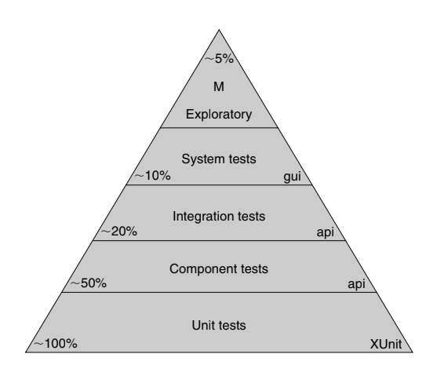

# The clean coder

A book that contains the experiences of a old programmer.

# My learnings

## Whe say no

Professionals speak truth to power. Professionals have the courage to say no to
their managers.

How do you say no to your boss? After all, it’s your boss! Aren’t you supposed to
do what your boss says?

No. Not if you are a professional.

Slaves are not allowed to say no. Laborers may be hesitant to say no. But
professionals are expected to say no. Indeed, good managers crave someone who
has the guts to say no. It’s the only way you can really get anything done.

## Depending on x's work

**It wouldn’t work because I rely on person X to get this done.**

You can only commit to things that you have full control of. For example, if
your goal is to finish a module that also depends on another team, you can’t
commit to finish the module with full integration with the other team. But
you can commit to specific actions that will bring you to your target. You
could:

• Sit down for an hour with Gary from the infrastructure team to understand
your dependencies.

• Create an interface that abstracts your module’s dependency from the other
team's infrastructure.

• Meet at least three times this week with the build guy to make sure your
changes work well in the company’s build system.

• Create your own personal build that runs your integration tests for the
module.

**See the difference?**

If the end goal depends on someone else, you should commit to specific actions
that bring you closer to the end goal.

It wouldn’t work because I don’t really know if it can be done.
If it can’t be done, you can still commit to actions that will bring you closer
to the target. Finding out if it can be done can be one of the actions to
commit to!

Instead of committing to fix all 25 remaining bugs before the release (which
may not be possible), you can commit to these specific actions that bring you
closer to that goal:

• Go through all 25 bugs and try to recreate them.

• Sit down with the QA who found each bug to see a repro of that bug.

• Spend all the time you have this week trying to fix each bug.

## Practicing

All professionals practice their art by engaging in skill-sharpening exercises.
Musicians rehearse scales. Football players run through tires. Doctors practice
sutures and surgical techniques. Lawyers practice arguments. Soldiers rehearse
missions. When performance matters, professionals practice. Practice no matter what.

- Leetcode
- Building projects

## The Test Automation Pyramid

Professional developers employ the discipline of Test Driven Development
to create unit tests. Professional development teams use acceptance tests to
specify their system, and continuous integration to prevent regression. But these tests are only part of the story. As good as it is to have a suite of unit and acceptance tests, we also need higher-level tests to ensure that QA finds nothing. The following figure shows the Test Automation Pyramid, a graphical depiction of the kinds of tests that a professional development
organization needs.

## Unit Tests

At the bottom of the pyramid are the unit tests. These tests are written by
programmers, for programmers, in the programming language of the system.
The intent of these tests is to specify the system at the lowest level. Developers
write these tests before writing production code as a way to specify what they
are about to write. They are executed as part of Continuous Integration to
ensure that the intent of the programmers’ is upheld.

At the bottom of the pyramid are the unit tests. These tests are written by
programmers, for programmers, in the programming language of the system.
The intent of these tests is to specify the system at the lowest level. Developers
write these tests before writing production code as a way to specify what they
are about to write. They are executed as part of Continuous Integration to
ensure that the intent of the programmers’ is upheld.

## Component Tests

These are some of the acceptance tests mentioned in the previous chapter.
Generally they are written against individual components of the system. The
components of the system encapsulate the business rules, so the tests for those
components are the acceptance tests for those business rules.

Component tests cover roughly half the system. They are directed more towards
happy-path situations and very obvious corner, boundary, and alternate-path
cases. The vast majority of unhappy-path cases are covered by unit tests and are
meaningless at the level of component tests.

## Integration Tests

These tests only have meaning for larger systems that have many components. These tests assemble groups of components and test how well they communicate with each other. The other components of the system are decoupled as usual with appropriate mocks and test-doubles.

Integration tests are choreography tests. They do not test business rules. Rather, they test how well the assembly of components dances together. They are plumbing tests that make sure that the components are properly connected and can clearly communicate with each other.

