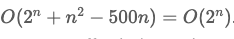

# Overview

What is an algorithm? An algorithm is a set of instructions that are followed to solve a problem. It is a step-by-step procedure that defines a set of instructions to be executed in a certain order to get the desired output.

Algorithms take an input and produce an output. The output will be the answer to a question regarding the input. For example, let's say you had a non-empty array of positive integers called nums, and you wanted to answer the question: "What is the largest number in nums?".

Algorithms take an input and produce an output. The output will be the answer to a question regarding the input. For example, let's say you had a non-empty array of positive integers called nums, and you wanted to answer the question: "What is the largest number in nums?".

To answer this question, you would write an algorithm that takes an array called nums as input, and outputs the largest number in nums. Here is an example of such an algorithm:

1. Create a variable maxNum and initialize it to 0.

2. Iterate over each element num in nums.

3. If num is greater than maxNum, update maxNum = num.

4. Output maxNum.

Here, we have written down a set of instructions that when followed, will solve the problem. We can now implement these instructions in code so that a computer can quickly solve the problem. There are some important requirements for algorithms in the context of LC:

- Algorithms should be deterministic. Given the same input, the algorithm should always produce the same output. Basically, there shouldn't be any randomness.

- The algorithm should be correct for any arbitrary valid input. In our example, we said that nums is a non-empty array of positive integers. There are infinitely many of such arrays, and our algorithm works for all of them. Note that if nums had negative numbers, the input would be invalid since we stated the integers are positive. In fact, our algorithm would actually break because we initialized maxNum to 0, so if all of nums was negative, we would incorrectly output 0.

# Big O

Big O is a notation used to describe the computational complexity of an algorithm. The computational complexity of an algorithm is split into two parts: time complexity and space complexity. The time complexity of an algorithm is the amount of time the algorithm needs to run relative to the input size. The space complexity of an algorithm is the amount of memory allocated by the algorithm when run relative to the input size.

```bash
Typically, people care about the time complexity more than the space complexity, but both are important to know.
```

Time complexity: as the input size grows, how much longer does the algorithm take to complete?

Space complexity: as the input size grows, how much more memory does the algorithm use?

# How complexity works?

Complexity is described by a function (math formula). What should the arguments to this function be?

The arguments are variables defined by the programmer, but they should represent values that change between different inputs, and these values should affect the algorithm. For example, the most common variable you'll see is **n**, which usually denotes the length of an input array or string. In the example above, we could say that **n** is equal to the length of nums.

Here, "the length of nums" is a value that changes between inputs, and it directly affects the algorithm. The longer **nums** is, the more elements we need to iterate through, and thus the longer our algorithm will take to complete.

In the context of LC, there are some common assumptions that we make. When dealing with integers, the larger the integer, the more time operations like addition, multiplication, or printing will take. While this is relevant in theory, we typically ignore this fact because the difference is practically very small, and treat all integers the same. If you are given an array of integers as an input, the only variable you would use is **n** to denote the length of the array. Technically, you could introduce another variable, let's say **k** which denotes the average value of the integers in the array. However, nobody does this.

When written, the function is wrapped by a capital O. Here are some example complexities:

- O(n): Linear time complexity. The time it takes to run the algorithm grows linearly with the input size. If the input size doubles, the time it takes to run the algorithm also doubles.

- O(n^2): Quadratic time complexity. The time it takes to run the algorithm grows quadratically with the input size. If the input size doubles, the time it takes to run the algorithm quadruples.

- O (2^n): Exponential time complexity. The time it takes to run the algorithm grows exponentially with the input size. If the input size doubles, the time it takes to run the algorithm squares.

- O(log n): Logarithmic time complexity. The time it takes to run the algorithm grows logarithmically with the input size. If the input size doubles, the time it takes to run the algorithm only increases by a constant amount.

- O(n * m): The time complexity of the algorithm is the product of the lengths of two input arrays. If the first array doubles in size, the time it takes to run the algorithm also doubles. The same applies to the second array.


These functions represent the complexity. For example, you would say "The time complexity of my algorithm is O(n)" or "The space complexity of my algorithm is O(n^2)". The function is a mathematical representation of how the algorithm scales with input size.

# Calculating complexity


Roughly, your function calculates the number of operations or amount of memory (depending on if you're analyzing time or space complexity, respectively) your algorithm consumes relative to the input size. Using the example from above (find the largest number in nums), we have a time complexity of O(n). The algorithm involves iterating over each element in nums, so if we define **n** as the length of nums, our algorithm uses approximately **n** steps. If we pass an array with a length of 10, it will perform approximately 10 steps. If we pass an array with a length of 10,000,000,000, it will perform approximately 10,000,000,000 steps.

**Time complexity is not meant to be an exact representation of the number of operations. For example, we needed to initialize maxNum = 0 and we also needed to output maxNum at the end. Thus, you could argue that for an array of length 10, we need 12 operations. This is not the point of time complexity. The point of time complexity is to describe how the number of operations changes as the input changes. The number of iterations we do depends on nums, but initializing maxNum = 0 doesn't.**

Being able to analyze an algorithm and calculate its time and space complexity is a crucial skill. Interviewers will almost always ask you for your algorithm's complexity to check that you actually understand your algorithm and didn't just memorize/copy the code. Being able to analyze an algorithm also enables you to determine what parts of it can be improved.

**Rules**

There are a few rules when it comes to calculating complexity. First, we ignore constants. That means (999n) = O(8n) = O(n).

Why do we do this? Imagine you had two algorithms. Algorithm A uses approximately n operations and algorithm B uses approximately 5n operations.

When n = 100 algorithm A uses 100 operations and algorithm B uses 500 operations. What happens if we double n Then algorithm A uses  200 operations and algorithm B uses 1000 operations. As you can see, when we double the value of n, both algorithms require double the amount of operations. If we were to 10x the value of n, then both algorithms would require 10x more operations.

**Remember: the point of complexity is to analyze the algorithm as the input changes. We don't care that algorithm B is 5x slower than algorithm A. For both algorithms, as the input size increases, the number of operations required increases linearly. That's what we care about. Thus, both algorithms are O(n).**

The second rule is that we consider the complexity as the variables tend to infinity. When we have addition/subtraction between terms of the same variable, we ignore all terms except the most powerful one.

For example:



Why? Because as n tends to infinity, 2^n becomes so large that the other two terms are effectively zero in comparison.

Let's say that we had an algorithm that required n + 500 operations.  It has a time complexity of O(n). When n is small, let's say + 500 term is very significant - but we don't care about that. We need to perform the analysis as if n is tending toward infinity, and in that scenario, the 500 is nothing.

The best complexity possible is O(1), called "constant time" or "constant space". It means that the algorithm ALWAYS uses the same amount of resources, regardless of the input.

**Note that a constant time complexity doesn't necessarily mean that an algorithm is fast (O(5000000)=O(1)), it just means that its runtime is independent of the input size.**

When talking about complexity, there are normally three cases:

- Best case scenario
- Average case
- Worst case scenario

In most algorithms, all three of these will be equal, but some algorithms will have them differ. If you have to choose only one to represent the algorithm's time or space complexity, never choose the best case scenario. It is most correct to use the worst case scenario, but you should be able to talk about the difference between the cases.

# Analyzing time complexity

Let's look at some example algorithms in pseudo-code and talk about their time complexities.

```java
for (int num: arr) {
    print(num)
}
```

This algorithm has a time complexity of O(n). In each for loop iteration, we are performing a print, which costs O(1). The for loop iterates n times, which gives a time complexity of O(1⋅n)=O(n).