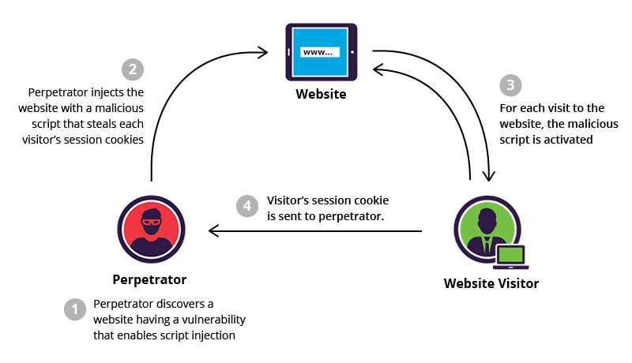

# Cross-scripting (XSS)

Code injection attacks using JavaScript can exploit cross-site scripting flaws. The application sends unverifiable data to browsers, and hackers seek the opportunity to insert malicious files on trustworthy web pages and exploit websites to send visitors to harmful programs. Cross-site scripting attacks are most likely to occur in web programs that incorporate unscreened user input into the outputs.

# Commands

npm start

# How to inject?

**Stored XSS:** The attacker injects malicious script into a website's database (e.g., through a comment field or user profile). When other users view the affected page, the script is executed in their browsers.

**Reflected XSS:** The attacker tricks a user into clicking a link that contains malicious script in the URL. The script is reflected off the web server and executed in the user's browser.

**DOM-based XSS:** The attacker manipulates the DOM environment in the victim's browser, causing the browser to execute the malicious script.

**Visual Explanation**

Reference: https://www.ox.security/top-javascript-vulnerabilities/

# How to prevent?

Validate and sanitize all user inputs.

Use Content Security Policy (CSP) headers to restrict the sources from which scripts can be loaded.

Implement proper escaping of data before rendering it in the browser.

Regularly update and patch software and libraries.

Use HTTPS to encrypt data in transit.

# Video example

