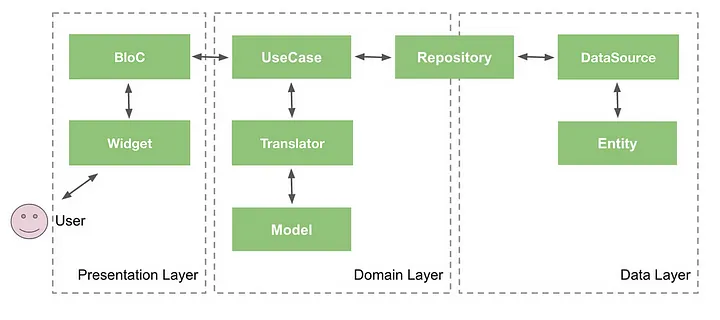
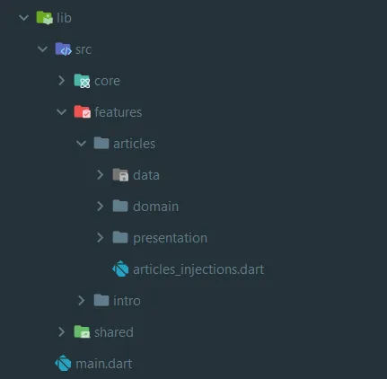

# Clean Architecture

Clean Architecture provides a way to structure applications that separate the different components of an application into modules, each with a well-defined purpose. The main idea behind Clean Architecture is to separate the application into three main layers: the presentation layer, the domain layer, and the data layer.



- Domain
- Data
- Presentation

# Domain Layer

This is the heart of your application.

It contains:

- Entities: Business objects (e.g., User, Product, NumberTrivia). These are pure Dart classes, free from framework dependencies.

- Use Cases (Interactors): Business logic operations (e.g., GetUserData, PlaceOrder, GetConcreteNumberTrivia). They orchestrate entities and repositories.

- Repositories (Interfaces): Abstract definitions of data access. They define what data operations are possible, not how they're implemented.

This layer knows nothing about the outside world.

# Data Layer

Handles data retrieval and manipulation.

- Models: Data transfer objects (DTOs) that map to external data sources (e.g., JSON from an API).

- Data Sources: Classes that interact with external data (e.g., API calls, database queries).

- Repositories (Implementations): Concrete implementations of the repository interfaces defined in the domain layer. They use data sources to fetch and process data.

Note:

- Entities are about "what" the business objects are and "how" they behave within the application's domain.

- Models are about "how" data is transferred between the application and external sources.

- Often, data from a model is used to create or update an entity.

Therefore the entity is the core business object, and the model is the data structure that transfers data to and from external sources.
 
# Presentation Layer

Handles the UI and user interactions.

Handles the UI and user interactions.
It contains:
- UI Components (Widgets): Flutter widgets that display data and handle user input.
- State Management (Bloc, Cubit, Provider, Riverpod): Manages the UI state and interacts with use cases.
- Dependency Injection: Injects use cases into the presentation layer.

## Extras Folders

**core:** The core folder is a fundamental module housing key components like utils, routes, network, services, validators, translators and styles. Its content can be tailored by developers to improve code cleanliness and adapt to evolving project needs, ensuring simplicity, modularity, and ease of maintenance.

**shared:** The shared folder, it is like features folder but for common feature in our application, like payment feature, shared pages, shared widgets, abd others.

Reference Article: https://medium.com/@yamen.abd98/clean-architecture-in-flutter-mvvm-bloc-dio-79b1615530e1



# MVVM

MVVM stands for Model-View-ViewModel, and it is a design pattern commonly used in software development, particularly in the context of user interface (UI) development. MVVM is often associated with frameworks that support data binding, where changes in the UI automatically update the underlying data and vice versa.

In Flutter, the MVVM is not as strictly defined as in some other frameworks that natively support data binding. However, developers often adopt MVVM principles in Flutter by structuring their code in a way that separates concerns, isolates presentation logic, and promotes maintainability.

Here’s a practical guide to implementing MVVM principles in Flutter:

**Model**

The Model represents the application’s data and business logic. It is responsible for managing the data and ensuring the consistency and integrity of the application. In the context of MVVM, the Model is often independent of the user interface and is designed to be reusable across different presentation layers.

In Flutter, the model typically consists of Dart classes or objects representing the data and business logic of your application. These classes encapsulate the application’s state and functionality. They don’t directly interact with the UI.

Example:

```dart
class User {
  String name;
  int age;

  User({required this.name, required this.age});
}
```

**View**

The View is responsible for presenting the data to the user and capturing user interactions. It is the user interface that users interact with. In MVVM, the View is kept as lightweight as possible and is primarily concerned with displaying information. It observes changes in the ViewModel and updates the UI accordingly.

In Flutter, the view is represented by widgets. Widgets are responsible for rendering UI elements and capturing user interactions. Keep your widgets as “dumb” as possible, minimizing logic in the UI components.

```dart
class UserView extends StatelessWidget {

  const UserView({required this.user});
  
  final User user;

  @override
  Widget build(BuildContext context) {
    return ListTile(
      title: Text(user.name),
      subtitle: Text('Age: ${user.age}'),
    );
  }
}
```

**ViewModel**

The ViewModel is the intermediary between the Model and the View. It contains the presentation logic, exposing data and commands that the View can bind to. The ViewModel is designed to be testable independently of the UI. It also often encapsulates the state of the View and handles user input and interactions.

While Flutter doesn’t have a native ViewModel, you can create Dart classes to act as ViewModels. ViewModels contain the presentation logic, handle data transformations, and provide a clean API for the UI to interact with the data.

Example:

```dart
import 'dart:async';

class UserViewModel {
  final StreamController<User> _userController = StreamController<User>();
  Stream<User> get userStream => _userController.stream;

  // Business logic and data transformation
  void updateUserAge(User user, int newAge) {
    final updatedUser = User(name: user.name, age: newAge);
    _userController.add(updatedUser);
  }

  // Dispose the controller to avoid memory leaks
  void dispose() {
    _userController.close();
  }
}
```

## Connecting View and ViewModel

In your Flutter application, you can use state management solutions like Provider, Riverpod, or even simple StatefulWidget to connect the View and ViewModel. These solutions help manage the state and notify the UI when data changes.

Example using Provider:

```dart
class UserPage extends StatelessWidget {
  @override
  Widget build(BuildContext context) {
    final userViewModel = Provider.of<UserViewModel>(context);

    return StreamBuilder<User>(
      stream: userViewModel.userStream,
      builder: (context, snapshot) {
        if (snapshot.hasData) {
          return UserView(user: snapshot.data!);
        } else {
          return CircularProgressIndicator();
        }
      },
    );
  }
}
```

TODO: In-depth explanation of Clean Architecture with Flutter
